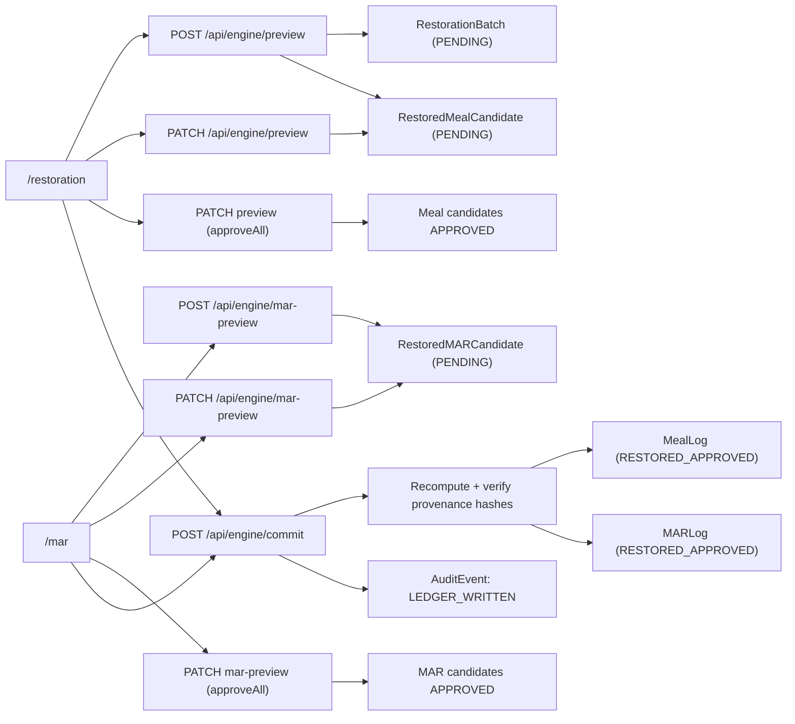
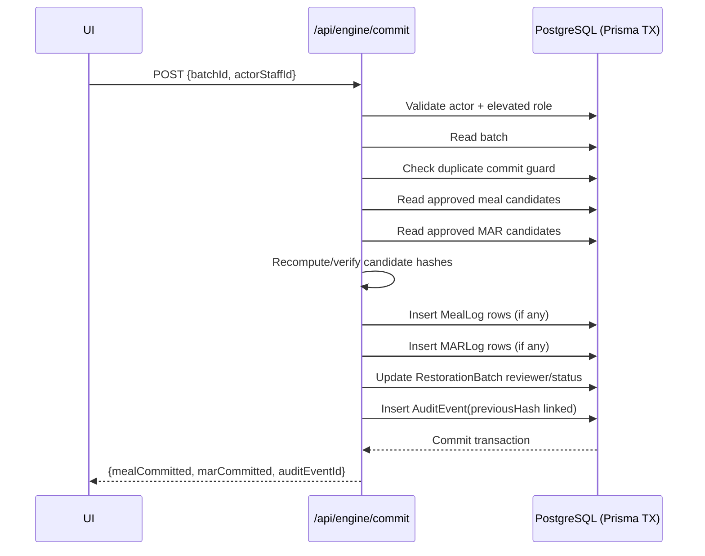

# Chartgen by gUBII Architecture Reference

Last updated: 2026-02-27

## 1) System Purpose

Chartgen reconstructs historical meal and medication charts as reviewed candidates before promotion into production ledger tables.

Design goals:

- preserve provenance for every reconstructed row
- enforce human review before ledger promotion
- support audit traceability through hash verification and audit-event chaining

## 2) Core Components

### UI

- `/` - enterprise landing page and product positioning
- `/login` - role-gated access control entrypoint
- `/deployment-notes` - deployment/ownership boundary notes
- `/audit-readiness` - audit-modelling framing page
- `/restoration` - meal preview, editing, approval, commit
- `/mar` - medication preview, editing, approval, commit
- shared tab navigation in `src/components/TabNav.tsx`

### API

- `POST /api/engine/preview` - generate meal candidates
- `PATCH /api/engine/preview` - edit meal candidate or `approveAll`
- `POST /api/engine/mar-preview` - generate MAR candidates
- `PATCH /api/engine/mar-preview` - edit MAR candidate or `approveAll`
- `POST /api/engine/commit` - commit approved candidates into ledger

### Domain Services

- `src/services/restoration/restorationEngine.ts` - generation logic for meal and MAR candidates
- `src/services/restoration/temporalRealism.ts` - timing variance generation
- `src/services/restoration/reviewWorkflow.ts` - review policy helpers (not currently wired into API routes)

### Data Layer

- PostgreSQL + Prisma with audit-aware schema in `prisma/schema.prisma`
- staged candidates: `RestoredMealCandidate`, `RestoredMARCandidate`
- production ledger: `MealLog`, `MARLog`
- audit ledger: `AuditEvent`

## 3) End-to-End Flow

## 4) Governance Rules (Current Implementation)

### `approveAll` rules in both preview routes

- `actorStaffId` is required
- actor must exist in `Staff`
- actor role must be `SUPERVISOR` or `CLINICAL_LEAD`
- actor cannot approve a batch they generated (`requestedByStaffId`)

Error codes used:

- `MISSING_FIELD`
- `ACTOR_NOT_FOUND`
- `FORBIDDEN_ROLE`
- `BATCH_NOT_FOUND`
- `SELF_APPROVAL_FORBIDDEN`

### Commit rules

- `actorStaffId` required and role-gated (`SUPERVISOR`/`CLINICAL_LEAD`)
- batch must exist
- duplicate commit blocked if batch already has `RESTORED_APPROVED` ledger rows
- at least one approved candidate required (meal and/or MAR)
- all candidate hashes must match recomputed values
- transaction wraps all writes

## 5) Data Model Notes

### Candidate status model

- Candidate rows start as `PENDING`
- `approveAll` marks candidates `APPROVED`
- batch status is also `CandidateStatus`; commit sets batch status to `APPROVED`

### MAR status model

`MARStatus` enum currently includes:

- `ADMINISTERED`
- `REFUSED`
- `HELD`

## 6) Commit Transaction Sequence

## 7) Known Architectural Gaps

- API testing is not yet wired to a runnable test framework.
- Authentication is currently password + signed session cookie; it is not yet identity-backed per user account.
- Personalization of generation priors from historical participant data is not implemented yet.
