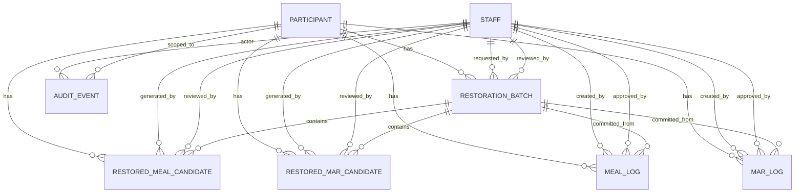
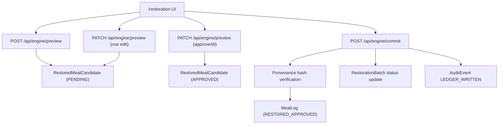

# ChartGen Architecture Reference

## 1) Technology Stack

### Runtime and Framework
- **Next.js 16 (App Router)** for server routes and UI pages.
- **React 19** for component-driven UI.
- **TypeScript** for typed API/UI/service logic.

### Data Layer
- **PostgreSQL 16** as the relational data store.
- **Prisma 6.17.1** as ORM + migration system.
- **Audit-first schema** (`prisma/schema.prisma`) with candidate staging, ledger logs, and audit events.

### Styling and Frontend Build
- **Tailwind CSS v4** (via `@tailwindcss/postcss`).
- **PostCSS** integration through `postcss.config.mjs`.

### Operational Tooling
- **Homebrew PostgreSQL service** for local DB runtime.
- Optional **Docker Compose** file (`docker-compose.yml`) included for containerized DB setup.

## 2) Core Functionalities

### A) Restoration Preview Generation
- Endpoint: `POST /api/engine/preview`
- Inputs: `participantId`, `startDate`, `endDate`, optional `generatedByStaffId`
- Behavior:
  1. Validates date range and participant.
  2. Creates `RestorationBatch` in `PENDING`.
  3. Generates clinically plausible mealtime candidates via `RestorationEngine`.
  4. Persists `RestoredMealCandidate` rows in `PENDING`.
  5. Returns `batchId` + candidate rows.

### B) Candidate Editing and Approval
- Endpoint: `PATCH /api/engine/preview`
- Supports:
  - Single-row updates (`amountEaten`, `timestamp`) with provenance hash recalculation.
  - Batch approval (`approveAll`) to mark candidates as `APPROVED`.

### C) Commit to Official Ledger
- Endpoint: `POST /api/engine/commit`
- Behavior:
  1. Enforces reviewer role (`SUPERVISOR` / `CLINICAL_LEAD`).
  2. Reads approved candidates for a batch.
  3. Verifies `provenanceHash` integrity before write.
  4. Writes immutable ledger rows into `MealLog` (`source = RESTORED_APPROVED`).
  5. Updates batch review state and writes `AuditEvent`.
  6. Uses Prisma transaction to avoid partial commits.

### D) Supervisor UI
- Page: `/restoration`
- Capabilities:
  - Generate preview by participant/date range.
  - Inline edit candidate fields.
  - Save row-level edits.
  - Commit approved batch to ledger.
  - Visual yellow highlight for rows with `deviationReason`.

## 3) Data Model (Visual)

## 4) Route Inventory

### Pages
- `GET /` - home entry page
- `GET /restoration` - supervisor control center UI

### API
- `POST /api/engine/preview` - generate and persist preview candidates
- `PATCH /api/engine/preview` - update one candidate OR approve all candidates in batch
- `POST /api/engine/commit` - commit approved candidates to official ledger

## 5) Route Flow (Visual)

## 6) Security and Integrity Controls

- Role-gated commit path for elevated staff only.
- Candidate-to-ledger write guarded by hash verification.
- Transactional commit to maintain consistency.
- Batch-level anti-duplication guard for committed rows.
- Error handling distinguishes validation errors vs DB availability issues.

## 7) Local Environment Requirements

- Running PostgreSQL service on `localhost:5432`.
- `DATABASE_URL` set in `.env`.
- Prisma migrated and seeded:
  1. `npx prisma migrate dev`
  2. `npx prisma db seed`

## 8) Seeded IDs for Current Local Setup

- Staff (Supervisor): `32213`
- Participant: `112334`

These IDs are used for immediate testing from `/restoration`.
