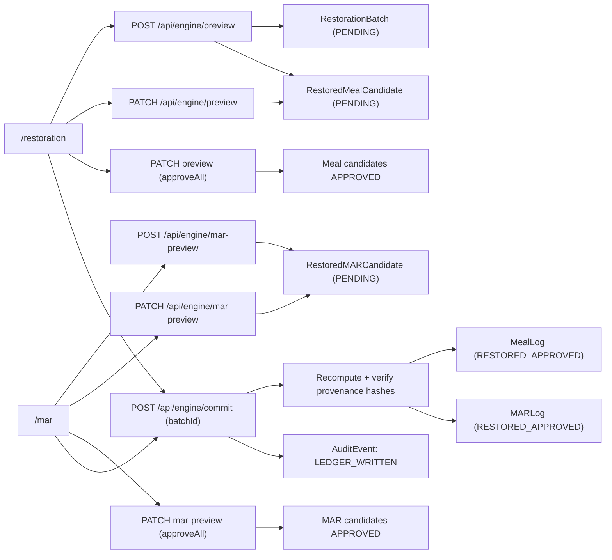
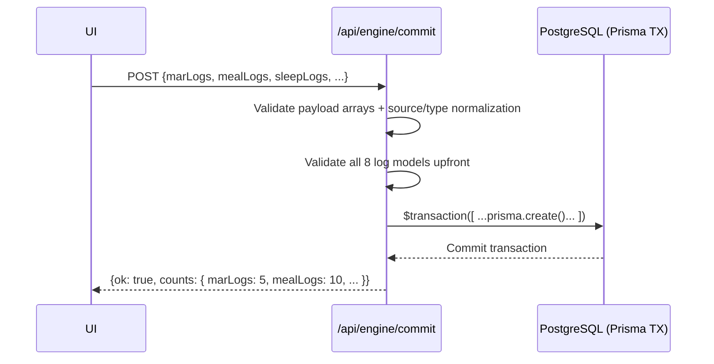

# Chartgen by gUBII Architecture Reference

Last updated: 2026-03-01

## 1) System Purpose

Chartgen reconstructs historical meal and medication charts as reviewed candidates, and generates synthetic QA logs across restoration modules before promotion into production ledger tables.

Design goals:

- preserve provenance for every reconstructed row
- enforce human review before ledger promotion
- support audit traceability through hash verification and audit-event chaining

## 2) Core Components

### UI

- `/` - enterprise landing page and product positioning
- `/whats-new` - staged release timeline (v1.0 through current release)
- `/login` - role-gated access control entrypoint
- `/deployment-notes` - deployment/ownership boundary notes
- `/audit-readiness` - audit-modelling framing page
- `/restoration` - meal preview, editing, approval, commit
- `/mar` - medication preview, editing, approval, commit
- `/audit-engine` - KPI trends and AI gap-report generation
- `/audit-explorer` - data table browser with filtering and pagination
- `/uat` - online UAT control center
- shared tab navigation in `src/components/TabNav.tsx`

### API

- `POST /api/engine/preview` - generate restoration bundle (meal candidates + MAR rows + Sleep/BGL/Bowel/Hygiene/Community/Reposition logs)
- `PATCH /api/engine/preview` - edit meal candidate or `approveAll`
- `POST /api/engine/mar-preview` - generate MAR candidates
- `PATCH /api/engine/mar-preview` - edit MAR candidate or `approveAll`
- `POST /api/engine/commit` - commit approved candidates into ledger (batch or grouped mode)
- `POST /api/engine/export-pdf` - on-demand PDF export for meal and MAR preview charts
- `GET /api/audit/kpi` - KPI computation
- `POST /api/audit/gap-report` - AI gap-report generation
- `GET /api/audit/gap-report` - List recent gap reports
- `GET /api/audit/gap-report/[id]` - Fetch a single gap report
- `GET /api/audit/explorer` - Data table browser for audit entities
- `GET /api/ops/db-health` - Database health check
- `POST /api/ops/uat` - UAT operations (stress tests, data cleanup)
- `GET /api/qa/detect-anomalies` - Blue Team anomaly detection

### Domain Services

- `src/services/restoration/restorationEngine.ts` - orchestration logic for candidate generation and modular chart synthesis
- `src/services/restoration/modules/*` - chart module implementations (Meal, Sleep, BGL, Bowel, Hygiene, Community, Repositioning)
- `src/services/restoration/stochasticEngine.ts` - seeded RNG, timeline cascade, and clinical domino logic
- `src/services/restoration/temporalRealism.ts` - timing variance generation
- `src/services/restoration/reviewWorkflow.ts` - review policy helpers (not currently wired into API routes)

### Data Layer

- PostgreSQL + Prisma with audit-aware schema in `prisma/schema.prisma`
- Staged candidates: `RestoredMealCandidate`, `RestoredMARCandidate`
- Production ledger: `MealLog`, `MARLog`, `SleepSettlingLog`, `BowelFluidLog`, etc.
- Audit ledger: `AuditEvent`, `GapReport`

## 3) End-to-End Flow (Legacy Batch)

## 4) Governance Rules (Current Implementation)

### `approveAll` rules in both preview routes

- `actorStaffId` is required
- actor must exist in `Staff`
- actor role must be `SUPERVISOR` or `CLINICAL_LEAD`
- actor cannot approve a batch they generated (`requestedByStaffId`)

Error codes used:

- `MISSING_FIELD`
- `ACTOR_NOT_FOUND`
- `FORBIDDEN_ROLE`
- `BATCH_NOT_FOUND`
- `SELF_APPROVAL_FORBIDDEN`

### Commit rules

**Legacy (batch-based):**
- `actorStaffId` required and role-gated (`SUPERVISOR`/`CLINICAL_LEAD`)
- `batchId` is required
- batch must exist and not have been previously committed
- at least one approved candidate required
- all candidate hashes must match recomputed values
- transaction wraps all writes

**Phase E (grouped):**
- No `batchId`; payload contains arrays of log objects
- Supports 8 log types: `marLogs`, `mealLogs`, `sleepLogs`, `bglLogs`, `bowelLogs`, `hygieneLogs`, `communityLogs`, `repositionLogs`
- Each array processed in transaction; all succeed or all fail
- Strict source/type validation (422 rejection of invalid sources/types)

## 5) Data Model Notes

### Candidate status model

- Candidate rows start as `PENDING`
- `approveAll` marks candidates `APPROVED`
- batch status is also `CandidateStatus`; commit sets batch status to `APPROVED`

### MAR status model

`MARStatus` enum currently includes:

- `ADMINISTERED`
- `REFUSED`
- `HELD`
- `LATE`
- `NOT_ADMINISTERED`

## 6) Commit Transaction Sequence (Grouped)

## 7) Known Architectural Gaps

- API testing is not yet wired to a runnable test framework.
- Authentication is currently password + signed session cookie; it is not yet identity-backed per user account.
- Personalization of generation priors from historical participant data is not implemented yet.
